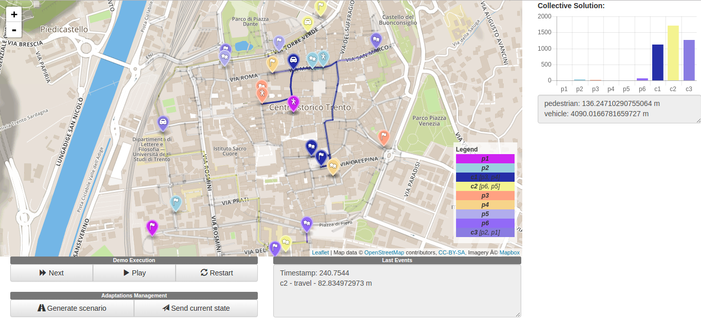

# Smart Carpooling Demo

This documentation aims to explain how the planning experiments in the *smart mobility* domain can be run.

1. [Installation](#installation)
	1. [Planning Environment](#planning-environment)
	1. [Python Libraries](#python-libraries)
1. [Usage](#usage)
	1. [Running a simple example](#run-default-example)
	1. [Running the Collective Adaptation Engine](#run-cae)
	1. [Creating Smart Mobility Problems](#create-sm-problems)
	1. [Plan visualization and creation of issues](#visualization-and-issue-creation)
1. [Credits](#credits)
1. [References](#references)

## <a name="installation"></a>Installation

### <a name="planning-environment"></a>Planning Environment

To run the experiments for this domain, you have to download/clone the [Temporal Planning](https://github.com/aig-upf/temporal-planning) repository:

```
git clone https://github.com/aig-upf/temporal-planning
```

Follow the [instructions](https://github.com/aig-upf/temporal-planning/blob/master/README.md) to compile the contents of this repository.

It is important that you have all folders (`universal-pddl-parser`, `temporal-planning`, `smart-carpool-demo`, `VAL`) in the same path.

### <a name="python-libs-installation"></a>Python Libraries

The installation of the following Python libraries is required to execute the tools contained in this repository:

* [Flask](http://flask.pocoo.org/docs/0.12/quickstart/)
* [Flask-CORS](https://flask-cors.readthedocs.io/en/latest/)
* [geopy](https://pypi.python.org/pypi/geopy)
* [openpyxl](http://openpyxl.readthedocs.io/en/default/)
* [parse](https://pypi.python.org/pypi/parse)
* [queuelib](https://pypi.python.org/pypi/queuelib)

You can install all of them at once using the following command:
```
pip install flask flask-cors geopy openpyxl parse queuelib
```

## <a name="usage"></a>Usage

### <a name="run-default-example"></a>Running a simple example
To test if everything has been correctly installed, you can follow this section. The file you will be running is called `parser.py` (inside the `parser` folder):

```
parser.py [-h] [--plan] [--json] [--visualize] [--time TIME] [--memory MEMORY] config
```

where:

* `-h` - shows help.
* `--plan` - whether the planner has to be executed.
* `--json` - whether the solution has to be converted into JSON format.
* `--visualize` - whether to run the local web server that allows the plan to be visualized.
* `--time` - the amount of time (in seconds) during which the planner will run. Default: 3600s.
* `--memory` - the maximum amount of memory (in MiB) used by the planner. Default: 4096 MiB.
* `config` - the path to a configuration/problem file. The format of these files is explained [here](#create-sm-problems).

You can use the configuration file `config.json` placed in `parser/config`. You just have to open the `smart-carpooling-demo` folder and run the following command:

```
./parser/parser.py --plan --json --visualize  parser/config/config.json
```

By running the previous command, you will see the following process:

1. The input map is parsed.
1. The planner starts and will stop as soon as a solution is found or one of the previous time/memory criterias is met.
1. If there is a solution, it will be converted into JSON format (see file `tmp_sas_plan.json`).
1. If there is a solution, a web server will be launched to serve the content for displaying the map. To see the map, just open the `index.html` file inside the `visualizer` folder (Google Chrome recommended). In 10 seconds,
the map will be displayed and the web server will close automatically.

### <a name="run-cae"></a>Running the Collective Adaptation Engine

The Collective Adaptation Engine (CAE) code is contained inside the `collective-adaptation-engine` folder. It is written in Java and it requires version 8 to run. You can directly import this folder from Eclipse.

This module automatically calls all the previous modules described in the [previous section](#run-default-example). The class you need to run to is `CollectiveMobility.java`.
The execution consists of several runs. Each run follows this process:

1. An initial random state is created.
1. The state is sent to the planner to get a collective solution.
1. Once a solution is obtained, an adaptation issue is introduced.
1. The issue is resolved in two ways: selfishly and collectively.
1. Statistics are collected from both the selfish and collective plans.

Once all runs have been executed, the overall statistics are exported to two files: `dataEvaluationCollective.csv`
and `dataEvaluationSelfish.csv`. The meaning of their columns is the following:

* `id` - number of run.
* `dv1` - number of vehicles involved.
* `dv2` - number of passenger involved.
* `dv3` - execution time of the adaptation.
* `dv4` - average of meters done by vehicles.
* `dv5` - average of meters done by passengers walking.
* `dv6` - total number of used agents used including the car pool company.

### <a name="create-sm-problems"></a>Creating Smart Mobility Problems
Mobility problems are specified using the JSON format. These problems are later converted into PDDL problems that can be solved by a temporal planner. A mobility problem written as JSON specifies the following fields:

* `map_path` - the path to the input OpenStreetMap.
* `map_boundaries` - object containing defining a rectangular area to analyse inside the map:
	* `min_latitude` - minimum latitude.
	* `max_latitude` - maximum latitude.
	* `min_longitude` - minimum longitude.
	* `max_longitude` - maximum longitude.
* `solution_type` - specifies whether the solution must be `collective` (agents may interact) or `selfish` (agents cannot interact).
* `pedestrians` - list of the pedestrians/passengers in the problem. Each contains the following fields:
	* `id` - a unique identifier.
	* `init_pos` - OSM label of its initial position.
	* `target_pos` - OSM label of its target position.
	* `walk_range` - maximum distance it can walk away from its origin and target positions.
* `carpools` - list of carpools in the problem. Each contains the following fields:
	* `id` - a unique identifier.
	* `init_pos` - OSM label of its initial position.
	* `target_pos` - OSM label of its target position.
* `blocked_streets` - list of blocked streets in the problem. Each contains the following fields:
	* `init_pos` - OSM label of its initial position.
	* `target_pos` - OSM label of its target position.
* `blocked_frontiers` - list of blocked frontiers. Each frontier is either specifies the field `latitude` or the field `longitude`.
All the streets crossing that frontier become blocked in the planning problem.

You can find examples of these files inside the `parser/config` folder.

### <a name="visualization-and-issue-creation"></a>Plan visualization and creation of issues
The visualizer allows plans to be displayed and also to introduce and remove issues. The following list shows what each of the navigation buttons does:

* `Play` - each of step in the plan is automatically displayed one after the other. Each state is shown for one second.
* `Pause` - stops the automatic displaying of the plan.
* `Step` - shows the next state in the plan.
* `Restart` - resets the visualizer to the first state (blocked streets are kept).

The issues (by now, blocked streets) can be removed or added by clicking on the desired street. Besides, they can be added or removed using the following buttons:

* `Toggle block random link` - adds or removes N random links specified in the textbox. These links are selected from the whole set of links.
* `Toggle block planned links` - adds or removes N random links specified in the textbox. These links are selected from the set of used links in the plan.
* `Toggle block planned link on step with probability X%` - at each step, a planned link toggles its block state with the probability specified in the checkbox.

Finally, for an issue to be solved, the `Send current state` button is used.



## <a name="credits"></a>Credits

The code for creating and solving smart mobility problems has been written by:

* Antonio Bucchiarone (Fondazione Bruno Kessler).
* Anders Jonsson (Universitat Pompeu Fabra).
* Daniel Furelos Blanco (Universitat Pompeu Fabra).

## <a name="references"></a>References
